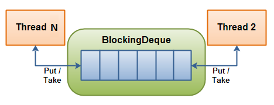

# Stream Management

 A simple Stream Management Service prototype

### Prerequisites
```
Java 11
Maven
```
### Commands
Clean and Install Project. This will create target folder, classes and executable jar.
```
mvn clean install
```
Execute Only Unit Tests
```
mvn surefire:test
```
Execute Only Integration Tests
```
mvn failsafe:integration-test
```
Execute the jar file via CLI. Make sure input exist and output not.
```
$ java -version
$ java -jar async-data-processing-1.0-simulate.jar <input_dir> <output_dir>
```

Execute via IDE
```
Project can be imported to one of IDEs(such as IntellijIdea, Eclipse) 
as a maven project and can be run or debugged.
```
##Event Definitions
An event can include below parts.

```Event Name (String)
User ID (String)
App ID (Number)
Product Description (String) (optional)
Purchase Date Time (Number)
```

## How it works:


There are three main actors in the application which are `Producer`, `Consumer` and `StreamManager`.

* QueueProducer is producing events and adding them to the queue. QueueProducer executes input files asynchronously via CompletableFuture as per thread per file.
So, multiple threads might be putting events to the queue. It validates all event through `EventFilter` and as per result it either creates an Event Object or puts the
event to the InvalidEvent.log file.
* QueueConsumer retrieves and removes the events from the queue, waits for the marker event to stop consuming the queue. QueueConsumer categories the events based on 
`Event Name` as per cvs file named with Event Name.
* StreamManager executes the QueueProducer and QueueConsumer via ExecutorService.



As shown on the above illustration, Producer is represented by Thread N which will produce events and insert them into the queue.
Consumer is represented by Thread 2(Single Thread) which will take an event and then will remove it from the queue.

## Notes
* `application.propeties` includes consumer and producer delays. These delays help us to simulate how async communication happens between consumer and producer. They can be increased or decreased as per scenario.
* We can define a new app or change the existing one by adding definition into `application.propeties #App List` without any modification in the code base.  
* We can define a new event or change the existing one by adding a pattern into `application.propeties #Event List` without any modification in the code base. `pattern` helps us to validate events.